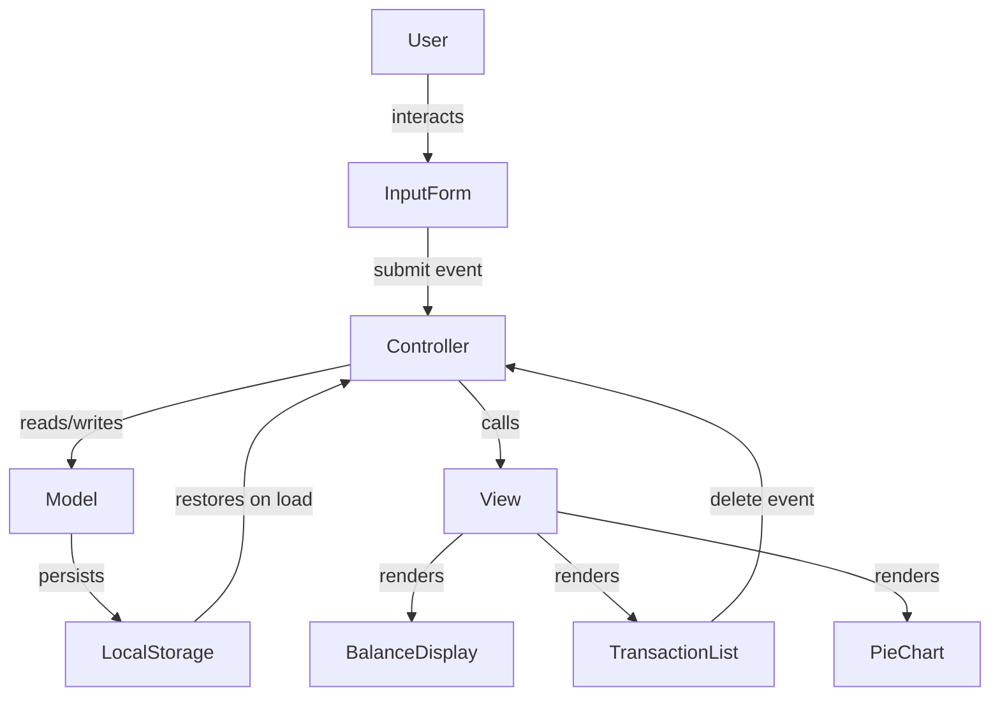

# Design Document: Expense & Budget Visualizer

## Overview

The Expense & Budget Visualizer is a single-page, client-side web application built with plain HTML, CSS, and Vanilla JavaScript. It enables users to record personal expense transactions, view a running total balance, browse a reverse-chronological transaction list, and understand spending distribution through a Chart.js pie chart. All data is persisted in the browser's `localStorage` so state survives page reloads without any backend.

The application is delivered as three files:

```
index.html        ← markup and CDN script tags
css/style.css     ← all styling
js/app.js         ← all application logic
```

No build tools, bundlers, or frameworks are used. The app targets Chrome 90+, Firefox 88+, Edge 90+, and Safari 14+.

---

## Architecture

The application follows a simple **Model → View → Controller** pattern implemented entirely within `js/app.js`:



- **Model** — an in-memory array of `Transaction` objects, mirrored to `localStorage` on every mutation.
- **View** — pure render functions that accept the current state and update the DOM / Chart.js instance.
- **Controller** — event handlers that validate input, mutate the model, persist it, and trigger re-renders.

Because the entire application is client-side and stateless between renders, there is no routing, no async I/O beyond `localStorage`, and no component framework needed.

---

## Components and Interfaces

### 1. Input Form (`#expense-form`)

| Element | ID / Class | Purpose |
|---|---|---|
| `<input type="text">` | `#item-name` | Item name, max 100 chars |
| `<input type="number">` | `#item-amount` | Positive amount, max 999,999.99 |
| `<select>` | `#item-category` | Food / Transport / Fun |
| `<button type="submit">` | `#add-btn` | Triggers validation + add |
| `<span>` | `.error-msg` (per field) | Inline validation error |

**Validation rules (Validator):**
- `item-name`: non-empty after trim, length ≤ 100
- `item-amount`: numeric, > 0, ≤ 999,999.99
- `item-category`: one of `["Food", "Transport", "Fun"]` (not the placeholder)

On successful submission the form is reset via `form.reset()`.

### 2. Balance Display (`#balance`)

A single `<span>` inside a header section. Updated by `renderBalance(transactions)` which sums all amounts and formats with `Intl.NumberFormat('en-US', { style: 'currency', currency: 'USD' })`.

### 3. Transaction List (`#transaction-list`)

A `<ul>` inside a fixed-height scrollable `<div>`. Each `<li>` contains:
- Item name
- Formatted amount
- Category badge
- Delete `<button data-id="...">` carrying the transaction's UUID

When the list is empty, a single `<li class="empty-state">No transactions yet.</li>` is shown.

### 4. Pie Chart (`#expense-chart`)

A `<canvas>` element managed by a single Chart.js `Pie` instance stored in `chartInstance`. The chart is created once on page load and updated via `chartInstance.data = ...` + `chartInstance.update()` on every state change. Zero-amount categories are excluded from the dataset. When all amounts are zero (or no transactions exist), the canvas is hidden and a `<p id="chart-empty">No data to display</p>` is shown instead.

### 5. Controller Functions (in `js/app.js`)

```
init()                  — runs on DOMContentLoaded; loads from storage, renders all views
handleFormSubmit(e)     — validates, creates Transaction, saves, renders
handleDeleteClick(e)    — finds transaction by id, removes, saves, renders
saveToStorage(txns)     — JSON.stringify + localStorage.setItem with try/catch
loadFromStorage()       — localStorage.getItem + JSON.parse with try/catch; returns [] on error
renderAll(txns)         — calls renderBalance, renderList, renderChart
renderBalance(txns)     — updates #balance text
renderList(txns)        — rebuilds #transaction-list innerHTML
renderChart(txns)       — updates chartInstance data and calls update()
showStorageError(msg)   — displays a dismissible banner to the user
```

---

## Data Models

### Transaction Object

```js
{
  id:       string,   // crypto.randomUUID() — unique identifier
  name:     string,   // item name, 1–100 chars
  amount:   number,   // positive float, ≤ 999999.99
  category: string,   // "Food" | "Transport" | "Fun"
  addedAt:  number    // Date.now() timestamp — used for sort order
}
```

### In-Memory State

```js
let transactions = [];   // Array<Transaction>, source of truth for all renders
```

### LocalStorage Schema

```
Key:   "ebv_transactions"
Value: JSON.stringify(Array<Transaction>)
```

On load, the stored JSON is parsed and validated (must be an array). If parsing fails or the key is absent, `transactions` defaults to `[]`.

### Category Metadata

```js
const CATEGORIES = {
  Food:      { color: "#FF6384" },
  Transport: { color: "#36A2EB" },
  Fun:       { color: "#FFCE56" }
};
```

Used by both the category dropdown and the Chart.js dataset to ensure consistent colors.

---

## Correctness Properties

*A property is a characteristic or behavior that should hold true across all valid executions of a system — essentially, a formal statement about what the system should do. Properties serve as the bridge between human-readable specifications and machine-verifiable correctness guarantees.*

### Property 1: Invalid inputs are rejected and leave state unchanged

*For any* combination of form field values where at least one field is invalid (empty name, whitespace-only name, name exceeding 100 chars, non-positive amount, amount exceeding 999,999.99, or unselected category), submitting the form SHALL NOT add a transaction to the list, and the transaction array SHALL remain unchanged.

**Validates: Requirements 1.1**

---

### Property 2: Valid submission resets the form

*For any* valid transaction input (non-empty name ≤ 100 chars, positive amount ≤ 999,999.99, valid category), after a successful form submission the input fields SHALL all be cleared/reset to their default state.

**Validates: Requirements 1.2**

---

### Property 3: Transaction list renders complete data in reverse chronological order

*For any* array of transactions, the rendered list SHALL display every transaction's item name, formatted amount, and category, and the entries SHALL appear in descending order of `addedAt` timestamp (most recently added first).

**Validates: Requirements 2.1, 2.2**

---

### Property 4: Every rendered list entry has a delete button with a matching id

*For any* non-empty array of transactions, every rendered `<li>` in the transaction list SHALL contain exactly one delete button whose `data-id` attribute equals the corresponding transaction's `id`.

**Validates: Requirements 2.3**

---

### Property 5: Balance equals the sum of all transaction amounts

*For any* array of transactions (including the empty array), the text content of the balance display SHALL equal the sum of all `amount` values formatted as USD currency (e.g. `$0.00` for an empty array).

**Validates: Requirements 3.1, 3.2**

---

### Property 6: Chart dataset values match per-category spending totals

*For any* array of transactions, the value of each category's slice in the Chart.js dataset SHALL equal the sum of `amount` values for all transactions belonging to that category.

**Validates: Requirements 4.1**

---

### Property 7: Zero-amount categories are excluded from the chart

*For any* array of transactions, if a category has no transactions (or all its transactions sum to zero), that category SHALL NOT appear in the Chart.js dataset labels or data array.

**Validates: Requirements 4.2**

---

### Property 8: LocalStorage round-trip preserves transaction data

*For any* array of `Transaction` objects, serializing the array to `localStorage` via `saveToStorage` and then deserializing it via `loadFromStorage` SHALL produce an array that is deeply equal to the original (same ids, names, amounts, categories, and timestamps).

**Validates: Requirements 5.1, 5.2**

---

## Error Handling

### LocalStorage Unavailable

`saveToStorage` and `loadFromStorage` both wrap their `localStorage` calls in `try/catch`. If `localStorage.setItem` throws (e.g. storage quota exceeded or access denied in a sandboxed context), the error is caught and `showStorageError` is called with a human-readable message. The in-memory `transactions` array is unaffected.

If `loadFromStorage` catches a `JSON.parse` error or finds a non-array value, it returns `[]` and calls `showStorageError` so the user knows their saved data could not be restored.

### Form Validation Errors

Each field has a paired `<span class="error-msg">` element. On submit, `validate()` checks all fields and populates the relevant spans with descriptive messages (e.g. "Item name is required", "Amount must be between 0.01 and 999,999.99"). The form submission is cancelled via `e.preventDefault()` and no transaction is created. Error messages are cleared on the next successful submission or when the user corrects the field.

### Chart Empty State

When `renderChart` is called with an empty transactions array (or one where all category totals are zero), the `<canvas>` element is hidden (`display: none`) and the `<p id="chart-empty">No data to display</p>` element is shown. When data is present, the canvas is shown and the paragraph is hidden.

### Transaction Not Found on Delete

If a `delete` click event fires with a `data-id` that does not match any transaction in the array (e.g. a stale DOM reference), the handler exits silently without mutating state. This is a defensive guard against edge cases in rapid click sequences.

---

## Testing Strategy

### Approach

This feature uses a **dual testing approach**:

- **Unit / example-based tests** — verify specific behaviors with concrete inputs (form validation edge cases, empty-state rendering, error handling paths).
- **Property-based tests** — verify universal invariants across randomly generated inputs (balance calculation, list ordering, chart data, localStorage round-trip).

Property-based testing is appropriate here because the core logic (validation, rendering, serialization, aggregation) consists of pure or near-pure functions whose correctness must hold across a large input space. The recommended library is **[fast-check](https://github.com/dubzzz/fast-check)** (JavaScript), which integrates with any test runner and supports arbitraries for strings, numbers, arrays, and custom objects.

### Property-Based Test Configuration

- Minimum **100 iterations** per property test (fast-check default is 100 runs).
- Each property test is tagged with a comment referencing the design property it validates.
- Tag format: `// Feature: expense-budget-visualizer, Property N: <property_text>`

### Unit Tests

Focus on:
- Specific validation edge cases: empty string, whitespace-only name, name of exactly 100 chars, name of 101 chars, amount of 0, amount of 999,999.99, amount of 1,000,000.
- Empty-state rendering: balance shows `$0.00`, list shows empty-state message, chart shows "No data to display".
- Error handling: `loadFromStorage` returns `[]` when localStorage contains `"not-json"` or a non-array value.
- Delete: removing the only transaction leaves an empty list; removing a middle transaction preserves order of remaining entries.

### Property Tests

Each property below maps to a correctness property in the design:

| Test | Property | fast-check Arbitrary |
|---|---|---|
| Invalid inputs rejected | Property 1 | `fc.record` with at least one invalid field generated |
| Valid submission resets form | Property 2 | `fc.record` of valid transaction fields |
| List order and completeness | Property 3 | `fc.array(transactionArbitrary)` |
| Delete buttons have matching ids | Property 4 | `fc.array(transactionArbitrary, { minLength: 1 })` |
| Balance equals sum | Property 5 | `fc.array(transactionArbitrary)` |
| Chart values match category totals | Property 6 | `fc.array(transactionArbitrary)` |
| Zero categories excluded from chart | Property 7 | `fc.array(transactionArbitrary)` with at least one category absent |
| LocalStorage round-trip | Property 8 | `fc.array(transactionArbitrary)` |

### Integration / Smoke Tests

- Page loads without JavaScript errors in a headless browser (Playwright or Puppeteer).
- Adding a transaction and reloading the page restores the transaction (end-to-end localStorage persistence).
- Responsive layout: no horizontal overflow at 360 px, 768 px, and 1280 px viewport widths (visual inspection or automated screenshot diff).
